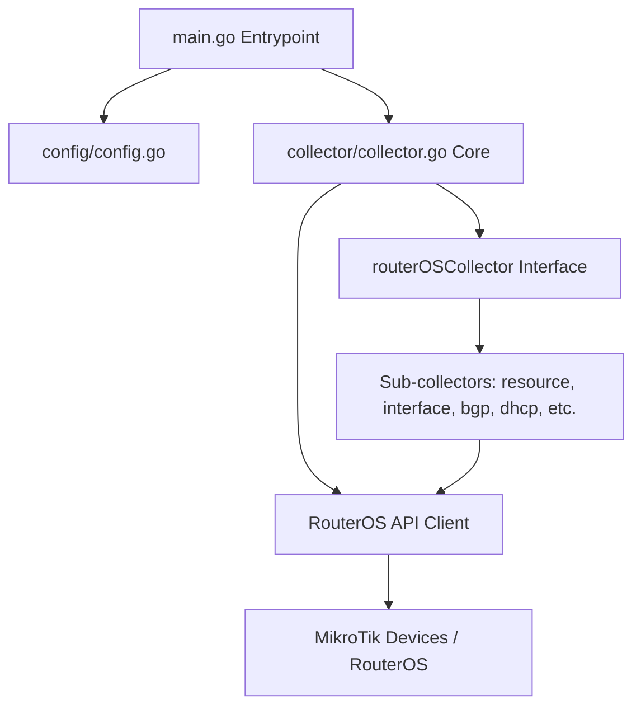

# 🤖 AI Agent & Developer Reference Guide (`AGENTS.md`)

Welcome! This guide provides a detailed overview of the **MikroTik Exporter** project structure, design patterns, architecture, and extension instructions. It is designed to help both human developers and agentic AI systems quickly understand and maintain the codebase.

---

## 📌 Project Overview
The **MikroTik Exporter** is a Prometheus exporter written in Go that gathers telemetry and health statistics from MikroTik devices running RouterOS. It communicates with RouterOS devices concurrently via the RouterOS API and exposes these metrics over HTTP in the Prometheus exposition format.

---

## 🏗️ Architecture & Module Structure



### 1. Entrypoint (`main.go`)
- Parses command-line flags (e.g. log formats, port, config file path).
- Loads targets/devices and feature toggles from `config`.
- Instantiates the core Prometheus collector and registers it.
- Serves the `/metrics` endpoint using Prometheus's official HTTP handler.

### 2. Configuration (`config/`)
- **`config.go`**: Parses the YAML configuration file (`devices` list and custom `features`).
- Supports specifying individual devices with `address`, `srv` record lookups, `user`, `password`, `port`, and `wifiwave2` tags.

### 3. Core Collector Engine (`collector/`)
- **`collector.go`**: Implements the `prometheus.Collector` interface (`Describe` and `Collect`).
  - Manages concurrent scraping across all configured devices using a `sync.WaitGroup` and Go routines.
  - Dynamically builds the active sub-collector list based on enabled features.
  - Automatically spins up connection clients (via `gopkg.in/routeros.v2`) per device scrape.
- **`routeros_collector.go`**: Defines the `routerOSCollector` interface:
  ```go
  type routerOSCollector interface {
      describe(ch chan<- *prometheus.Desc)
      collect(ctx *collectorContext) error
  }
  ```
- **`collector_context.go`**: Passes thread-safe context (`prometheus.Metric` channel, current device config, and authenticated `routeros.Client`) to each sub-collector.

### 4. Specialized Sub-Collectors (`collector/*_collector.go`)
Every metrics category has its own implementation of the `routerOSCollector` interface. Examples include:
- `resource_collector.go`: Queries CPU, memory, uptime, disk space, and OS version from `/system/resource/print`.
- `interface_collector.go`: Queries bytes, packets, and errors per interface from `/interface/print`.
- `bgp_collector.go`: Gathers BGP session states from `/routing/bgp/peer/print`.
- `dhcp_collector.go` / `dhcp_lease_collector.go`: Gathers lease counts, active leases, and pools.

---

## 🛠️ How to Add a New Sub-Collector

To add support for a new RouterOS statistics category:

1. **Update the Configuration**:
   In `config/config.go`, add your new feature flag (in camel-case/lowercase YAML tag matching standard conventions):
   ```go
   MyFeature bool `yaml:"myfeature,omitempty"`
   ```

2. **Define the Collector**:
   Create a new file under `collector/myfeature_collector.go`. Implement the `routerOSCollector` interface:
   ```go
   package collector

   import (
       "github.com/prometheus/client_golang/prometheus"
       "gopkg.in/routeros.v2/proto"
   )

   type myFeatureCollector struct {
       description *prometheus.Desc
   }

   func newMyFeatureCollector() routerOSCollector {
       return &myFeatureCollector{
           description: prometheus.NewDesc(
               "mikrotik_myfeature_metric_value",
               "Description of my new feature metric",
               []string{"device"}, nil,
           ),
       }
   }

   func (c *myFeatureCollector) describe(ch chan<- *prometheus.Desc) {
       ch <- c.description
   }

   func (c *myFeatureCollector) collect(ctx *collectorContext) error {
       // Run the RouterOS command
       reply, err := ctx.client.Run("/interface/myfeature/print")
       if err != nil {
           return err
       }
       // Parse and expose metric
       for _, re := range reply.Re {
           val := parseVal(re.Map["some-property"])
           ctx.ch <- prometheus.MustNewConstMetric(c.description, prometheus.GaugeValue, val, ctx.device.Name)
       }
       return nil
   }
   ```

3. **Register the Option**:
   In `collector/collector.go`, expose an option function:
   ```go
   func WithMyFeature() Option {
       return func(c *collector) {
           c.collectors = append(c.collectors, newMyFeatureCollector())
       }
   }
   ```

4. **Hook into Main**:
   In `main.go`, add conditional registration when parsing the loaded config features:
   ```go
   if cfg.Features.MyFeature {
       opts = append(opts, collector.WithMyFeature())
   }
   ```

---

## 🚀 CI/CD & Compilation (`ko`)

This project has been migrated from CircleCI to **GitHub Actions** with an optimized multi-arch containerization flow powered by **`ko`**:

- **Workflow File**: `.github/workflows/ci.yml`
- **Compiler Config**: `.ko.yaml`
- **Build Targets**: `linux/amd64` and `linux/arm64` cross-compiled directly via Go toolchain without needing local Docker engines or QEMU.
- **Image Repository**: Published automatically to GitHub Container Registry (`ghcr.io/nshttpd/mikrotik-exporter`).
- **Tagging Convention**:
  - `trunk` branch: Tagged with the short Git commit SHA (e.g. `ab12cd3`).
  - Releases matching `v*`: Tagged with the exact semantic tag version (e.g. `v1.2.3`).
- **Embedded Metadata**: Application version metadata (`appVersion` and `shortSha`) are injected into `main.go` package variables during container builds via `ldflags` dynamically set in `.ko.yaml`.
